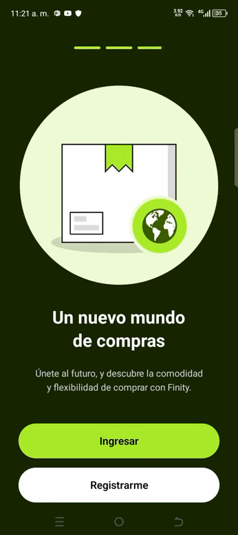

# Onboarding NativeWind — React Native Expo

## Instalación

```bash
git clone <repo-url>
cd reactnative-expo-test
npm install
npm start
```

## Requisitos

- Node.js >= 18
- Expo CLI
- Dispositivo Android o emulador

## Uso

1. Ejecuta `npm start` y escanea el QR con Expo Go.
2. Verás la vista de onboarding con tres pantallas, imágenes reales y estilos NativeWind.

## Notas técnicas

- Todos los estilos usan clases Tailwind vía NativeWind v4.
- No se utiliza StyleSheet.create.
- Los assets están en la carpeta `assets/`.
- El fondo cubre toda la pantalla.
- Los indicadores de progreso son barras largas para el activo.

## Capturas


